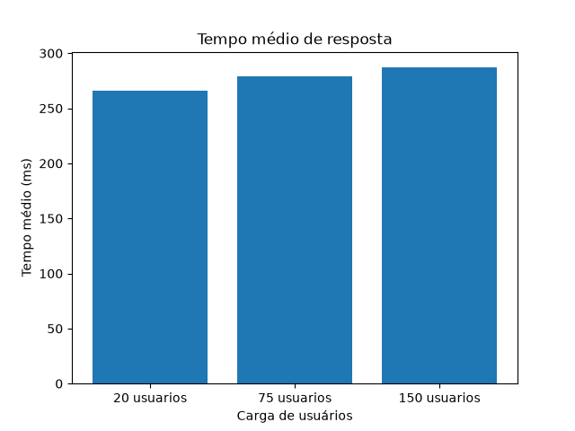
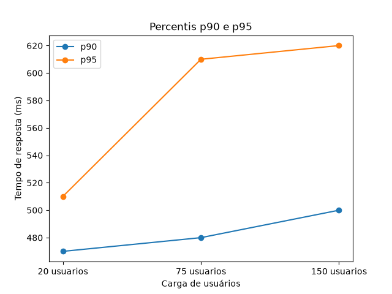
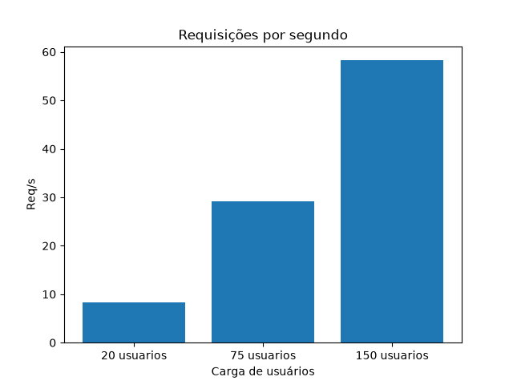
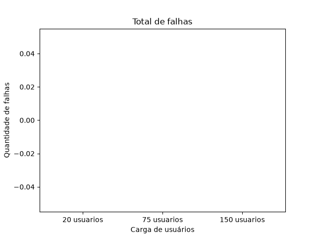

# Relatório de Teste de Performance com Locust

## 1. Introdução

Este trabalho apresenta um teste de performance utilizando a ferramenta Locust. O objetivo foi simular usuários acessando um sistema web e analisar como a aplicação se comporta com diferentes quantidades de usuários simultâneos.

Para isso, foram definidos cenários de uso, executados testes em modo headless e coletados resultados em arquivos CSV. Depois, os dados foram analisados com Python, usando pandas e matplotlib para gerar gráficos.

## 2. Sistema escolhido

O sistema escolhido foi o Restful-Booker, uma API pública criada para prática de testes em sistemas web.

Essa API simula um sistema de reservas de hotel, permitindo consultar reservas, buscar detalhes de uma reserva, criar autenticação e cadastrar novas reservas.

A escolha foi feita porque o Restful-Booker possui endpoints acessíveis, permite requisições GET e POST e é um ambiente voltado para testes. Além disso, pode ser usado sem interferir em sistemas institucionais ou de produção.

## 3. Planejamento dos testes

O planejamento dos testes foi feito pensando em ações comuns dentro de uma API de reservas. Foram escolhidos cenários de consulta, autenticação e criação de reserva, para que o teste não ficasse limitado apenas a acessos simples.

Também foram usados pesos nas tarefas do Locust. Os pesos servem para indicar quais ações devem acontecer com mais frequência durante a simulação. As consultas receberam pesos maiores, pois normalmente um usuário consulta mais informações do que cadastra novos dados.

### Cenários definidos

| Cenário                          | Método | Endpoint                            | Peso |
| -------------------------------- | ------ | ----------------------------------- | ---- |
| Verificar se a API está online   | GET    | `/ping`                             | 1    |
| Listar reservas                  | GET    | `/booking`                          | 5    |
| Filtrar reservas por data        | GET    | `/booking?checkin=...&checkout=...` | 3    |
| Consultar detalhe de uma reserva | GET    | `/booking/{id}`                     | 4    |
| Criar autenticação               | POST   | `/auth`                             | 2    |
| Criar nova reserva               | POST   | `/booking`                          | 1    |

Com esses cenários, o teste atende ao requisito de possuir 5 ou mais cenários de uso e também possui pelo menos 2 cenários com POST.

## 4. Cargas de usuários e execução

Os testes foram executados em três níveis de carga: 20, 75 e 150 usuários simultâneos.

A escolha dessas cargas foi feita para comparar o comportamento da API em situações diferentes. Primeiro foi usada uma carga mais baixa, depois uma carga intermediária e, por último, uma carga mais alta.

| Teste   | Usuários simultâneos |          Taxa de subida |  Duração |
| ------- | -------------------: | ----------------------: | -------: |
| Teste 1 |          20 usuários |  2 usuários por segundo | 1 minuto |
| Teste 2 |          75 usuários |  5 usuários por segundo | 1 minuto |
| Teste 3 |         150 usuários | 10 usuários por segundo | 1 minuto |

Com 20 usuários, a ideia foi verificar se os cenários estavam funcionando corretamente e se a API respondia sem falhas.

Com 75 usuários, o objetivo foi observar o comportamento com uma carga intermediária, verificando se o tempo de resposta começava a aumentar.

Com 150 usuários, a carga foi maior, servindo para observar se apareceriam falhas, lentidão ou algum possível gargalo.

Os testes foram executados em modo headless, e os resultados foram exportados em arquivos CSV usando o parâmetro `--csv`.

## 5. Resultados obtidos

Após a execução dos testes, os resultados principais foram organizados na tabela abaixo.

| Usuários | Total de requisições | Falhas | Tempo médio |    p90 |    p95 | Req/s |
| -------: | -------------------: | -----: | ----------: | -----: | -----: | ----: |
|       20 |                  466 |      0 |   224,67 ms | 310 ms | 460 ms |  8,17 |
|       75 |                  569 |      0 |   306,05 ms | 620 ms | 770 ms | 22,75 |
|      150 |                 3367 |      0 |   280,15 ms | 470 ms | 490 ms | 57,01 |

Os testes não apresentaram falhas, mesmo com o aumento da quantidade de usuários simultâneos. O throughput aumentou conforme a carga subiu, passando de 8,17 requisições por segundo no teste com 20 usuários para 57,01 requisições por segundo no teste com 150 usuários.

O tempo médio de resposta teve uma variação entre os testes. Com 75 usuários, o tempo médio foi maior do que no teste com 150 usuários. Como o Restful-Booker é uma API pública acessada pela internet, essa variação pode ter relação com a rede ou com o momento em que cada teste foi executado.

## 6. Gráficos dos resultados

Para facilitar a análise, foram gerados gráficos a partir dos arquivos CSV exportados pelo Locust. Os gráficos foram criados com Python, usando as bibliotecas pandas e matplotlib.

### Tempo médio de resposta

O gráfico de tempo médio mostra a variação do tempo de resposta entre os testes com 20, 75 e 150 usuários. O maior tempo médio apareceu no teste com 75 usuários, enquanto no teste com 150 usuários o tempo médio ficou um pouco menor.

### Percentis p90 e p95

Os percentis p90 e p95 ajudam a observar o comportamento das requisições mais lentas. No teste com 75 usuários, os valores de p90 e p95 ficaram mais altos, indicando que uma parte das requisições demorou mais nesse teste.

### Throughput

O gráfico de throughput mostra que a quantidade de requisições por segundo aumentou conforme a quantidade de usuários simultâneos também aumentou. Isso indica que a API conseguiu atender mais requisições quando recebeu uma carga maior.

### Falhas

O gráfico de falhas mostra que não houve falhas registradas nos testes executados. Isso é um ponto positivo, pois mesmo com o aumento da carga para 150 usuários, a API continuou respondendo sem erros registrados pelo Locust.

## 7. Análise crítica

Analisando os resultados, a API se comportou bem nos três testes. Mesmo aumentando a carga de usuários, não apareceu nenhuma falha registrada pelo Locust. Isso mostra que, dentro do tempo testado, o sistema conseguiu responder às requisições.

O teste com 75 usuários foi o que teve os maiores tempos de resposta, principalmente nos percentis p90 e p95. Isso quer dizer que algumas requisições demoraram mais nesse teste. Mesmo assim, como não houve falhas, não dá para dizer que foi um gargalo grave.

No teste com 150 usuários, o número de requisições por segundo aumentou bastante. Isso foi um ponto positivo, porque mostrou que a API conseguiu atender mais requisições quando recebeu uma carga maior.

Não dá para afirmar com certeza que algum endpoint está mal otimizado, porque eu não tenho acesso ao código interno do Restful-Booker. Também é importante lembrar que a API é pública e depende da internet, então os resultados podem variar de uma execução para outra.

De forma geral, não encontrei uma regressão clara de performance. O sistema teve variações no tempo de resposta, mas continuou funcionando sem falhas nos três níveis de carga.

## 8. Explicação do código Locust

O arquivo principal do teste é o `locustfile.py`. Nele foi criada a classe `UsuarioReserva`, que representa um usuário acessando a API durante o teste.

O trecho `wait_time = between(1, 3)` faz o usuário esperar entre 1 e 3 segundos entre uma ação e outra. Usei isso para o teste não ficar totalmente artificial, como se o usuário fizesse várias requisições sem pausa nenhuma.

Cada método marcado com `@task` representa uma ação que o usuário pode fazer. Por exemplo, listar reservas, buscar por data, consultar uma reserva específica, autenticar e criar uma reserva.

Os números dentro do `@task`, como `@task(5)` e `@task(1)`, são os pesos. Eles indicam quais ações devem acontecer mais vezes. A listagem de reservas ficou com peso maior, porque é uma ação mais comum. A criação de reserva ficou com peso menor, porque normalmente acontece menos.

Também usei o `random` em algumas partes para variar os dados do teste, como escolher uma reserva para consultar e gerar um preço diferente ao criar uma nova reserva.

## 9. Conclusão

Com este trabalho foi possível aplicar testes de performance usando o Locust em uma API pública de reservas. Foram criados cenários com requisições GET e POST, usando pesos para simular melhor o uso do sistema.

Os testes foram executados com 20, 75 e 150 usuários simultâneos. Em todos eles, a API respondeu sem falhas registradas. O throughput aumentou conforme a carga também aumentou, mostrando que o sistema conseguiu atender mais requisições por segundo.

Apesar de algumas variações no tempo de resposta, principalmente no teste com 75 usuários, não foi identificado um problema grave de desempenho. Como o sistema testado é uma API pública, essas variações podem ter relação com a internet ou com o momento da execução.

De forma geral, os resultados foram positivos, pois o sistema se manteve disponível e sem falhas durante os testes realizados.
